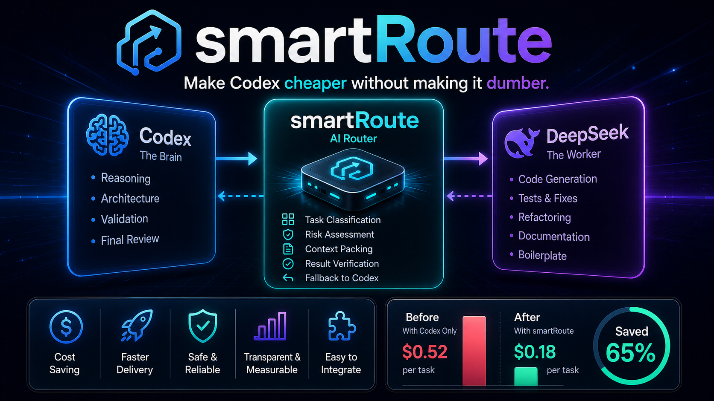

# smartRoute

> Make Codex cheaper without making it dumber.

<p align="center">
  <a href="./README_zh.md"><strong>中文文档</strong></a>
</p>



smartRoute is an MCP tool that turns Codex into a cost-aware router.
It pushes low-risk development work to a cheaper worker LLM, keeps high-risk
judgment in Codex, and returns enough interaction detail that you can feel when
the tool is active.

- Lower-cost execution for tests, docs, search, and explanation work
- Codex stays responsible for architecture, security, protected domains, and final review
- Global-by-default Codex install, so every workspace can use the same MCP tool
- DeepSeek by default, with presets for OpenAI, Anthropic, Gemini, Qwen, Ollama, LM Studio, and more
- One-time local provider setup in `~/.codexsaver/config.json`
- Verified with tests, real DeepSeek calls, and end-to-end MCP launcher checks

---

## Why This Exists

Most coding sessions contain two very different kinds of work:

- expensive thinking
- cheap execution

Codex is excellent at the first one. It is overqualified for much of the second.

smartRoute splits the flow on purpose:

- `Codex` handles reasoning, ambiguity, protected domains, and approval
- a configured worker provider handles low-risk throughput work

That gives you a practical pattern:

```text
Use the expensive model for judgment.
Use the cheaper model for volume.
Never confuse the two.
```

---

## What It Feels Like

When smartRoute is active, tool responses are not silent blobs of JSON.
They include an `interaction` block that makes the routing decision visible:

```json
{
  "interaction": {
    "tool": "codexsaver.delegate_task",
    "mode": "delegated_execution",
    "headline": "smartRoute delegated this task to the configured worker provider.",
    "route_label": "[smartRoute] route=deepseek task_type=write_tests risk=low",
    "next_step": "Review the worker result and apply it only if the patch looks safe."
  }
}
```

Three states matter:

- `preview`: routing preview only, no external model call
- `delegated_execution`: delegated run completed
- `codex_takeover`: task stayed with Codex because risk was too high or the task was ambiguous

---

## Quick Start

### Recommended Global Install

```bash
git clone git@github.com:kcd-dev/smartRoute.git
cd smartRoute

python cli.py auth set --provider deepseek --api-key YOUR_API_KEY
python cli.py install
python cli.py doctor
```

That is it. `python cli.py install` writes a global Codex MCP entry to
`~/.codex/config.toml` and points it at a stable launcher:
`~/.codexsaver/codexsaver_mcp.py`.

After that, every Codex workspace can call:

```text
codexsaver.delegate_task
```

Use `--project` only when you want a repository-local `.codex/config.toml`:

```bash
python cli.py install --project
```

### Provider Setup

Built-in providers already ship with a preset `base_url`, so in most cases you only
choose the provider, save the API key, and optionally override the model.
You usually do **not** need to pass `--base-url`.

Examples of built-in defaults:

- `deepseek` → `https://api.deepseek.com/chat/completions`
- `openai` → `https://api.openai.com/v1/chat/completions`
- `anthropic` → `https://api.anthropic.com/v1/messages`
- `ollama` → `http://localhost:11434/v1/chat/completions`
- `lmstudio` → `http://localhost:1234/v1/chat/completions`

See the full preset list:

```bash
python cli.py auth providers
```

#### Built-in providers: usually no `--base-url` needed

DeepSeek is the default because it is inexpensive and exposes an OpenAI-compatible API.
Switching providers is usually just `--provider` plus an optional `--model`:

```bash
python cli.py auth set --provider deepseek --api-key YOUR_API_KEY
python cli.py auth set --provider openai --api-key YOUR_API_KEY --model gpt-4o-mini
python cli.py auth set --provider anthropic --api-key YOUR_API_KEY --model claude-3-5-haiku-latest
python cli.py auth set --provider gemini --api-key YOUR_API_KEY --model gemini-2.0-flash
python cli.py auth set --provider qwen --api-key YOUR_API_KEY --model qwen-plus
```

Local models also have preset local endpoints:

```bash
python cli.py auth set --provider ollama --model llama3.1
python cli.py auth set --provider lmstudio --model local-model
```

#### When you should pass `--base-url`

Pass `--base-url` when:

1. you use `--provider custom`
2. you route through a proxy / gateway / compatibility layer
3. you want to override a built-in provider's default endpoint

#### Custom provider: `--base-url` is required

```bash
python cli.py auth set \
  --provider custom \
  --api-key YOUR_API_KEY \
  --base-url https://example.com/v1/chat/completions \
  --model your-model
```

#### Override a built-in provider with your own OpenAI-compatible gateway

```bash
python cli.py auth set \
  --provider openai \
  --api-key YOUR_API_KEY \
  --model gpt-4o-mini \
  --base-url https://gateway.example.com/v1/chat/completions
```

`python cli.py auth set` persists the chosen provider, model, API key, and
`base_url` to:

```text
~/.codexsaver/config.json
```

Temporary override without changing local config:

```bash
export CODEXSAVER_BASE_URL=https://gateway.example.com/v1/chat/completions
python cli.py doctor
```

Provider-specific env vars also work, for example:

```bash
export DEEPSEEK_BASE_URL=https://gateway.example.com/v1/chat/completions
python cli.py doctor
```

Current base_url precedence in the code is:

1. `--base-url`
2. `CODEXSAVER_BASE_URL`
3. provider-specific env var such as `DEEPSEEK_BASE_URL`
4. `~/.codexsaver/config.json`
5. built-in preset

Check the effective value with:

```bash
python cli.py doctor
```

Look for:

```json
{
  "provider_base_url": "https://api.deepseek.com/chat/completions",
  "provider_base_url_source": "preset"
}
```

If you prefer a temporary one-shell-session setup instead of saving the key locally:

```bash
export CODEXSAVER_PROVIDER=deepseek
export CODEXSAVER_API_KEY=YOUR_API_KEY
python cli.py install
python cli.py doctor
```

### One Message To Codex

If Codex is already open in this repository, you can just say:

```text
Save my worker provider API key for smartRoute, run `python cli.py auth set --provider deepseek --api-key ...`, then run `python cli.py install` and `python cli.py doctor`, and tell me whether it is ready.
```

For repo-local setup:

```text
Save my worker provider API key for smartRoute, install smartRoute only for this repo, run `python cli.py auth set --provider deepseek --api-key ...`, `python cli.py install --project`, then `python cli.py doctor`, and summarize the result.
```

Ready means:

- `~/.codex/config.toml` contains the global `codexsaver` MCP server, or `.codex/config.toml` exists in the repo
- `~/.codexsaver/codexsaver_mcp.py` exists for global installs
- provider settings are available from env vars or `~/.codexsaver/config.json`
- `python cli.py doctor` reports `smartRoute is ready`

---

## 60-Second Demo

Global MCP config created by `python cli.py install`:

```toml
[mcp_servers.codexsaver]
command = "python"
args = ["/Users/you/.codexsaver/codexsaver_mcp.py"]
startup_timeout_sec = 10
tool_timeout_sec = 120
```

Then tell Codex:

```text
Use smartRoute for safe low-risk tasks.
Add unit tests for user service.
```

Or call the CLI directly:

```bash
python cli.py delegate "Explain the routing logic briefly" --files codexsaver/router.py --workspace .
```

Dry run:

```bash
python cli.py "add unit tests for user service" --files src/user/service.ts --workspace . --dry-run
```

Real run:

```bash
python cli.py "add unit tests for user service" --files src/user/service.ts --workspace .
```

---

## Verified Setup Flow

Measured on May 8, 2026 with the global install and local-key workflow:

| Check | Command | Result |
|---|---|---|
| Full test suite | `PYTHONDONTWRITEBYTECODE=1 python -m pytest -q -p no:cacheprovider` | `86 passed in 0.23s` |
| Global install | `python cli.py install --workspace .` | `status=ok`, global config points at `~/.codexsaver/codexsaver_mcp.py` |
| Local provider persistence | `python cli.py auth set --provider deepseek --api-key ...` | saved to `~/.codexsaver/config.json` |
| Workspace doctor | `python cli.py doctor --workspace .` | `provider_api_key_source=local_config:deepseek`, workspace ready |
| Global launcher check | `python ~/.codexsaver/codexsaver_mcp.py` with MCP `initialize` | returned `serverInfo.name=codexsaver` |
| Real DeepSeek call | `python cli.py delegate "Explain the smartRoute router..." --files codexsaver/router.py --workspace .` | `route=deepseek`, `status=success`, verification passed |

This is the intended workflow:

1. Save the key once
2. Install smartRoute globally
3. Confirm readiness with `doctor`
4. Use real delegated calls without re-exporting API keys

---

## Provider Matrix

Built-in presets cover the common hosted and local routes:

| Provider | Style | Default model | API key |
|---|---|---|---|
| `deepseek` | OpenAI-compatible | `deepseek-chat` | required |
| `openai` | OpenAI | `gpt-4o-mini` | required |
| `anthropic` | native Messages API | `claude-3-5-haiku-latest` | required |
| `gemini` | OpenAI-compatible endpoint | `gemini-2.0-flash` | required |
| `qwen` | OpenAI-compatible endpoint | `qwen-plus` | required |
| `ollama` | local OpenAI-compatible endpoint | `llama3.1` | not required |
| `lmstudio` | local OpenAI-compatible endpoint | `local-model` | not required |

Run `python cli.py auth providers` for the complete list.

---

## Post-Setup Usage Ratio

After setup completed, I measured the actual routed tasks in this working session.
I only counted tasks that truly entered model routing, not local commands like `pytest`,
`git`, `install`, `doctor`, or README editing.

Result:

- `DeepSeek`: `7 / 8 = 87.5%`
- `Codex`: `1 / 8 = 12.5%`

Why not 100%?

One test-writing prompt originally included the phrase `production logic`.
That triggered the router's intentional high-risk keyword guard and returned the task to Codex.
This was not a failure. It was the protection logic working as designed.

If you only count the later standardized five-task benchmark with natural low-risk phrasing,
the delegation ratio was:

- `DeepSeek`: `5 / 5 = 100%`
- `Codex`: `0 / 5 = 0%`

Takeaway:

- In real usage, smartRoute defaulted to DeepSeek for most low-risk work
- It still preserved a strict fallback path for risky wording and protected domains

---

## Five-Task A/B Benchmark

Method:

- **A** = counterfactual `Codex-only` baseline with normalized cost index fixed at `1.00`
- **B** = `smartRoute` mode with the live router and DeepSeek worker
- latency is wall-clock time for the real smartRoute execution
- savings come from the current `CostEstimator`, so this is a reproducible routing benchmark, not invoice-grade billing data

Summary:

- All 5 tasks were typical low-risk development chores: explanation, docs, tests, and README maintenance
- All 5 delegated successfully after using natural low-risk phrasing
- Average live latency was `6.18s`
- Average estimated savings were `48.4%`
- Average normalized cost moved from `1.00` to `0.52`
- Estimated relative reduction was `48.0%`

| Task | Type | Route | Latency | A: Codex-only Cost Index | B: smartRoute Cost Index | Estimated Savings | Output Shape |
|---|---|---|---:|---:|---:|---:|---|
| Explain router logic | `explain` | `deepseek` | `2.13s` | `1.00` | `0.55` | `45%` | read-only summary |
| Document router module | `docs` | `deepseek` | `3.13s` | `1.00` | `0.55` | `45%` | 1-file patch |
| Add cost tests | `write_tests` | `deepseek` | `9.29s` | `1.00` | `0.55` | `45%` | test patch |
| Explain verifier flow | `explain` | `deepseek` | `2.30s` | `1.00` | `0.55` | `45%` | read-only summary |
| Update install docs | `docs` | `deepseek` | `14.06s` | `1.00` | `0.38` | `62%` | README patch |


Figure:
Gray bars are the `Codex-only` baseline fixed at `100`.
Green bars are the `smartRoute` cost index for the same task.
Lower bars mean lower estimated Codex spend.

Interpretation:

- Read-only explain tasks were the fastest, cleanest wins
- Small docs edits delegated well and returned compact, reviewable patches
- Test generation had higher latency than explanation, but still stayed in the low-risk savings band
- Larger-context documentation work produced the biggest estimated savings because the Codex-only context cost would be higher

---

## Routing Rules

### Good Tasks To Delegate

- repo scanning and code search
- code explanation and summarization
- writing unit tests
- fixing lint or type errors
- documentation updates
- boilerplate generation
- small localized refactors

### Tasks Kept In Codex

- architecture decisions
- auth, security, payment, billing, or permissions logic
- database migrations
- deployment and production operations
- ambiguous product requests
- final review before applying changes

### Why Some Medium-Risk Tasks Still Delegate

smartRoute does not just ask:

```text
Is this code work?
```

It asks:

```text
Is this code work cheap enough to delegate without losing judgment quality?
```

That creates a deliberate asymmetry:

- read-only understanding can be cheap
- writes in sensitive domains are expensive in risk even if the diff is small
- ambiguity defaults to Codex, not delegation

That is why `Explain auth code` may still delegate while `Refactor auth service` stays in Codex.

---

## How It Works

```text
User
  ↓
Codex
  ↓ MCP tool call
smartRoute
  ├─ Router
  ├─ Context Packer
  ├─ Worker LLM Provider
  ├─ Verifier
  └─ Cost Estimator
  ↓
Codex review / apply / finalize
```

Core modules:

- `Router`: classify tasks and assign risk
- `ContextPacker`: bound file context before delegation
- `ProviderClient`: call the configured worker model
- `Verifier`: validate output shape, protected paths, and suggested commands
- `CostEstimator`: estimate relative savings bands

---

## Security And Persistence

- `python cli.py auth set --provider ... --api-key ...` saves provider settings to `~/.codexsaver/config.json`
- the config file is written with local-user-only permissions
- `doctor` shows whether the key comes from the environment or local config, and only prints a masked preview
- live calls use local config automatically if no env key is exported
- if verification fails, smartRoute falls back to `needs_codex`

---

## Commands

```bash
python cli.py auth providers
python cli.py auth set --provider deepseek --api-key YOUR_API_KEY
python cli.py install
python cli.py install --project
python cli.py doctor
python cli.py delegate "Explain the routing logic briefly" --files codexsaver/router.py --workspace .
```

---

## Roadmap

- [x] MCP server
- [x] rule-based routing
- [x] bounded context packing
- [x] DeepSeek default worker integration
- [x] multi-provider OpenAI-compatible worker support
- [x] local API key persistence
- [x] interaction-aware tool responses
- [x] end-to-end verification flow
- [ ] cost-aware dynamic routing
- [ ] cost-aware provider selection

---

## If This Saves You Money

Star the repo.
